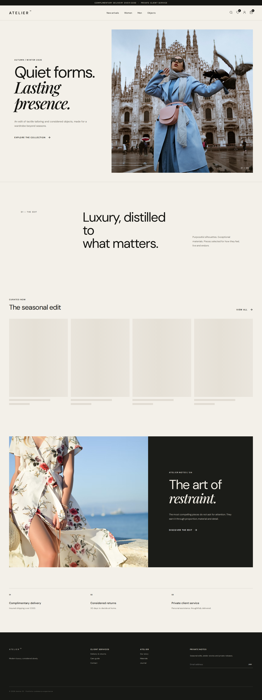
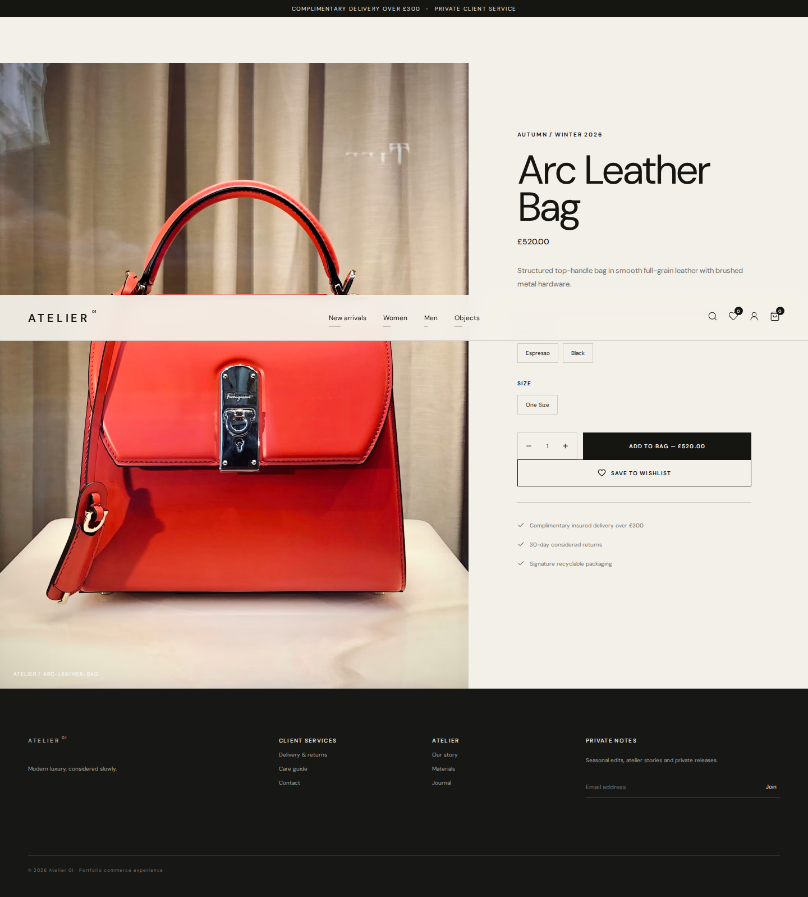
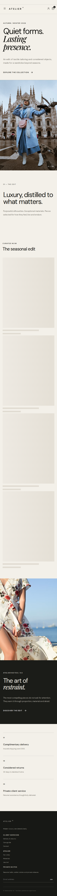

# ATELIER 01 — Luxury E-commerce Store

A client-ready full-stack luxury fashion commerce experience built with React, Vite and Supabase. The visual direction combines editorial fashion storytelling with restrained commerce UX: oversized typography, warm neutral surfaces, immersive imagery, clear product hierarchy and low-friction shopping flows.

> Portfolio commerce build: checkout writes real demo orders to Supabase, but intentionally does **not** collect or simulate real payment-card credentials.

## QA captures

The GitHub quality workflow generates these screenshots from the actual production build on desktop and mobile and commits them after a successful run.





The same workflow records a 30+ second Playwright showcase video and uploads it as the `atelier-showcase-assets` workflow artifact.

## Features

- Editorial luxury homepage with seasonal storytelling and curated products
- Supabase-backed catalog with responsive product grid
- Search, category navigation, price filtering and sorting
- Product detail with colour, size, quantity, wishlist and add-to-bag interactions
- Persistent authenticated cart and wishlist
- Email/password authentication through Supabase Auth
- Private account area with editable profile, avatar upload and order history
- Supabase Storage avatar bucket with ownership policies and file constraints
- Checkout flow creating `orders` and `order_items`, then clearing the bag
- Real loading, empty, error and success states
- Desktop, tablet and mobile layouts plus reduced-motion support
- Automated production build and desktop/mobile Playwright QA

## Design direction

The interface is original rather than a clone. Research focused on recurring contemporary luxury-commerce patterns: editorial-scale imagery, generous whitespace, refined typography, curated discovery, restrained product cards and simple filtering. References included current luxury retail patterns from TOTEME and KHAITE plus recent fashion-commerce work on Behance and Dribbble. Those principles were translated into the distinct ATELIER 01 visual identity.

## Architecture

```text
Browser / React 18
├── Layout + responsive navigation
├── Home / Shop / Product
├── Cart / Wishlist
├── Account / Profile / Avatar
└── Checkout / Order confirmation
        │
        ▼
Supabase JS client (publishable key only)
        ├── Auth
        ├── Postgres Data API
        │   ├── profiles
        │   ├── categories
        │   ├── products
        │   ├── wishlist_items
        │   ├── cart_items
        │   ├── orders
        │   └── order_items
        └── Storage
            ├── avatars
            └── product-media
```

The browser receives only the project URL and **publishable** key. No `service_role` or secret key is used by the React client. User-owned data is protected at the database layer with RLS.

## Supabase security

All application tables have RLS enabled and grants are narrower than the Supabase defaults.

| Resource | Anonymous | Authenticated |
| --- | --- | --- |
| categories / products | SELECT | SELECT |
| profiles | none | own SELECT / INSERT / UPDATE |
| wishlist_items | none | own SELECT / INSERT / DELETE |
| cart_items | none | own SELECT / INSERT / UPDATE / DELETE |
| orders | none | own SELECT / INSERT |
| order_items | none | SELECT/INSERT only when parent order belongs to user |
| avatars | public read | owner upload/update/delete under `{user_id}/...` |

The profile trigger is a narrowly scoped `SECURITY DEFINER` function used by the auth trigger; direct execution is revoked from `PUBLIC`, `anon` and `authenticated`. Foreign-key/RLS filter columns are indexed. Supabase security advisors returned no security lints after hardening.

## Local setup

```bash
git clone https://github.com/mabdula2004/luxury-Ecommerce-with-Backend-.git
cd luxury-Ecommerce-with-Backend-
npm install
cp .env.example .env.local
npm run dev
```

Fill `.env.local` with browser-safe project credentials:

```env
VITE_SUPABASE_URL=https://YOUR_PROJECT_REF.supabase.co
VITE_SUPABASE_PUBLISHABLE_KEY=sb_publishable_YOUR_KEY
```

Never place a secret key or `service_role` key in a `VITE_` variable.

## Database setup

For a fresh Supabase project apply, in order:

```text
supabase/migrations/001_store_schema.sql
supabase/migrations/002_seed_catalog.sql
```

`001_store_schema.sql` creates the relational model, RLS policies, least-privilege grants, auth profile trigger, indexes and Storage buckets/policies. `002_seed_catalog.sql` adds the portfolio catalog with conflict-safe inserts.

Connected backend: Supabase project `Luxury E-commerce Store` (`kzexzrdiyzjjtmzrgkiy`).

## Build and QA

```bash
npm run build
npm run preview
npm run test:e2e
```

GitHub Actions runs the production build, installs Chromium, exercises the storefront on desktop and mobile, captures screenshots and records a real 30+ second interaction walkthrough. A failed build or E2E test fails the quality gate.

## Structure

```text
src/
├── components/      Layout, ProductCard, StatePanel
├── lib/             Supabase client and formatting helpers
├── pages/           Home, Shop, Product, Cart, Wishlist, Account, Checkout
├── App.jsx
└── styles.css
supabase/migrations/
tests/store.spec.js
.github/workflows/quality.yml
```

## Production notes

- Product imagery uses remote editorial demo imagery; replace with owned/commissioned brand assets for a client deployment.
- A real store should create payment intents server-side through a payment provider and verify webhooks before marking orders paid.
- Product administration belongs in a trusted back-office surface or Supabase dashboard, never in a public client with elevated keys.

## Stack

React 18 · Vite · React Router · Supabase Auth · Supabase Postgres · Row Level Security · Supabase Storage · Lucide React · Playwright · GitHub Actions
